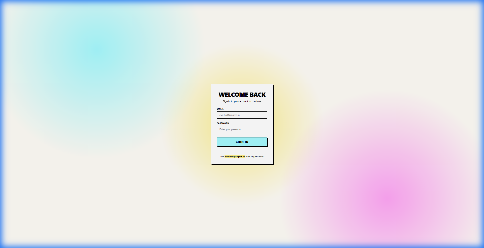
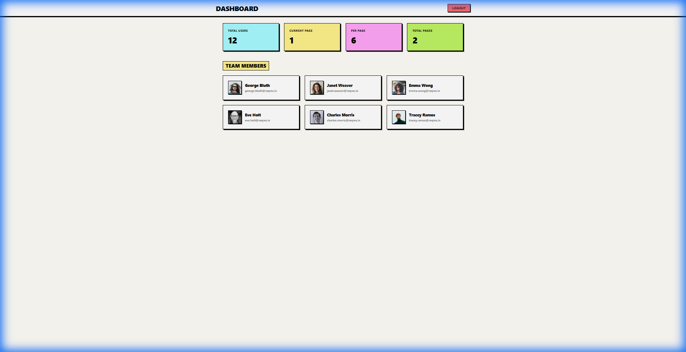
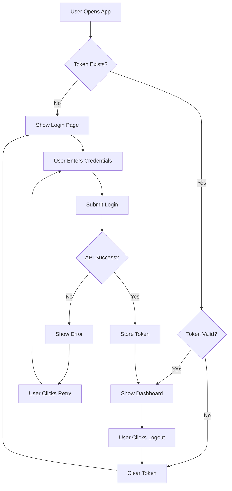

# API Integration & Authentication Flow (Frontend)

A professional React authentication system with **Neo-Brutalism UI** design, demonstrating real-world patterns for state management, protected routes, and API integration.

## 🚀 Live Demo

**URL:** https://api-integration-authentication-flow.vercel.app/

### Test Credentials
| Field | Value |
|-------|-------|
| **Email** | `eve.holt@reqres.in` |
| **Password** | `cityslicka` |



---

## Features

- **Neo-Brutalism UI** - Bold, colorful design inspired by modern brutalist web design
- **Complete Auth Flow** - Login, logout, token management, and protected routes
- **Dashboard** - Displays user data from ReqRes API with colorful stat cards
- **Error Handling** - User-friendly error states with retry functionality
- **Token Expiry** - Automatic 30-minute session timeout
- **Responsive** - Works on all screen sizes

---

## Screenshots

### Login Page
The login page features a bold Neo-Brutalism design with:
- Colorful gradient background (cyan, pink, yellow orbs)
- Bold black borders on all elements
- Cyan "Sign In" button with press-down effect
- Pink focus state on input fields


### Dashboard
After logging in, users see the dashboard with:
- **Stat Cards** - Colorful cards showing Total Users, Current Page, Per Page, Total Pages
- **Team Members Grid** - User cards with avatars and hover effects
- **Logout Button** - Red brutalist button in the header



---

## Architecture

```
src/
├── api/                    # Centralized API layer
│   ├── client.js          # Axios instance with interceptors
│   ├── auth.api.js        # Login/register endpoints
│   └── dashboard.api.js   # User data endpoints
├── auth/                   # Authentication system
│   ├── AuthContext.jsx    # React Context for auth state
│   ├── authService.js     # Token management logic
│   └── ProtectedRoute.jsx # Route guard component
├── components/             # Reusable UI components
│   ├── Loader.jsx         # Loading spinner
│   ├── ErrorState.jsx     # Error display
│   └── RetryButton.jsx    # Retry action button
├── pages/                  # Page components
│   ├── Login.jsx          # Login form
│   ├── Login.css          # Neo-Brutalism login styles
│   ├── Dashboard.jsx      # User dashboard
│   └── Dashboard.css      # Neo-Brutalism dashboard styles
├── routes/                 # Routing configuration
│   └── AppRoutes.jsx      # Route definitions
├── utils/                  # Utilities
│   ├── storage.js         # LocalStorage helpers
│   └── constants.js       # App constants
├── App.jsx                # Root component
└── App.css                # Neo-Brutalism design system
```

---

## Authentication Flow



### Auth States

| State | Description |
|-------|-------------|
| `loading` | Checking token validity on app load |
| `authenticated` | Valid token exists, user has access |
| `unauthenticated` | No token or expired, redirect to login |

### Token Management

- **Storage**: `localStorage` with timestamp
- **Expiry**: 30 minutes (configurable in `constants.js`)
- **Validation**: Automatic on app load
- **401 Handling**: Global via Axios interceptor

---

## Neo-Brutalism Design System

The UI uses a bold, playful design system with these CSS custom properties:

```css
:root {
  /* Colors */
  --neo-cyan: #A6FAFF;    /* Primary buttons */
  --neo-yellow: #FEF08A;  /* Highlights */
  --neo-pink: #FFA6F6;    /* Focus states */
  --neo-lime: #BEF264;    /* Success */
  --neo-red: #FF6B6B;     /* Logout/errors */
  
  /* Borders & Shadows */
  --border-style: 2px solid #000;
  --shadow-md: 4px 4px 0px #000;
}
```

### Key Design Elements

| Element | Styles |
|---------|--------|
| **Buttons** | Bold borders, offset shadows, press-down effect |
| **Cards** | White bg, black borders, hard shadows |
| **Inputs** | Black borders, pink focus background |
| **Stat Cards** | Cyan, Yellow, Pink, Lime backgrounds |

---

## Running Locally

### Prerequisites
- Node.js 18+
- npm or yarn

### Installation

```bash
# Clone the repository
git clone <your-repo-url>
cd "API integration & authentication Flow (FE)"

# Install dependencies
npm install

# Start development server
npm run dev
```

The app will open at `http://localhost:5174`

### Test Credentials

| Email | Password |
|-------|----------|
| `eve.holt@reqres.in` | `cityslicka` |

---

## Testing the Auth Flow

1. **Wrong credentials** - Error message with retry button
2. **Correct credentials** - Redirect to dashboard
3. **Refresh on dashboard** - Stay authenticated
4. **Click logout** - Clear token, redirect to login
5. **Access `/dashboard` logged out** - Redirect to login
6. **Wait 30+ minutes** - Token expires, auto-logout

---

## API Integration

### ReqRes API
Uses [ReqRes](https://reqres.in) as a mock backend with Vite proxy to avoid CORS issues.

**Endpoints Used:**
- `POST /api/login` - Authentication
- `GET /api/users` - Dashboard user data

### Mock Fallback
If ReqRes API is unavailable (e.g., Cloudflare blocking), the app falls back to mocked authentication with the same credentials.

---

## Environment Variables

```env
# .env
VITE_API_BASE_URL=https://reqres.in/api
```

For local development with Vite proxy, you can use `VITE_API_BASE_URL=/api`.

---

## Design Decisions

### Why Context API over Redux?
- **Simpler** for auth state (only 3 states)
- **Less boilerplate** than Redux
- **Built into React** - no extra dependencies

### Why Separate API Layer?
- **Single source** for API configuration
- **Automatic token injection** via interceptors
- **Centralized error handling**

### Why Neo-Brutalism?
- **Eye-catching** and memorable design
- **High contrast** for accessibility
- **Modern trend** in web design

---

## Tech Stack

| Technology | Purpose |
|------------|---------|
| **React 19** | UI framework |
| **Vite** | Build tool & dev server |
| **React Router v7** | Client-side routing |
| **Axios** | HTTP client with interceptors |
| **ReqRes API** | Mock backend |
| **CSS Variables** | Neo-Brutalism design system |

---

## Branch Structure

| Branch | Purpose |
|--------|---------|
| `feature/core-api-setup` | API layer, utilities, project structure |
| `feature/auth-system` | AuthContext, Login, protected routes |
| `feature/dashboard-routes` | Dashboard, routing, README |
| `main` | Production-ready merged code |

---

## License

MIT License - feel free to use this project as a reference!
